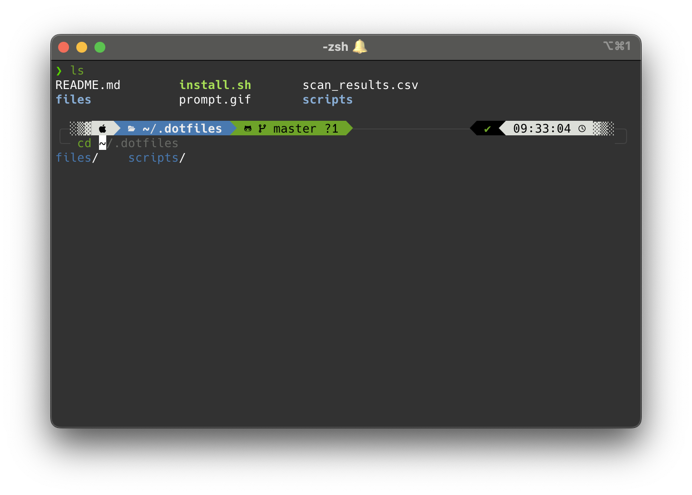

# dotfiles

Just a collection of config files for my development environment

## Structure

- `files/` - Contains all dotfiles that will be symlinked to home directory
- `scripts/` - Contains utility scripts (automatically added to PATH via .zshenv)
- `install.sh` - Installation script

## Install

```bash
git clone --recursive https://github.com/drewzh/dotfiles.git ~/.dotfiles
cd ~/.dotfiles && ./install.sh
```
